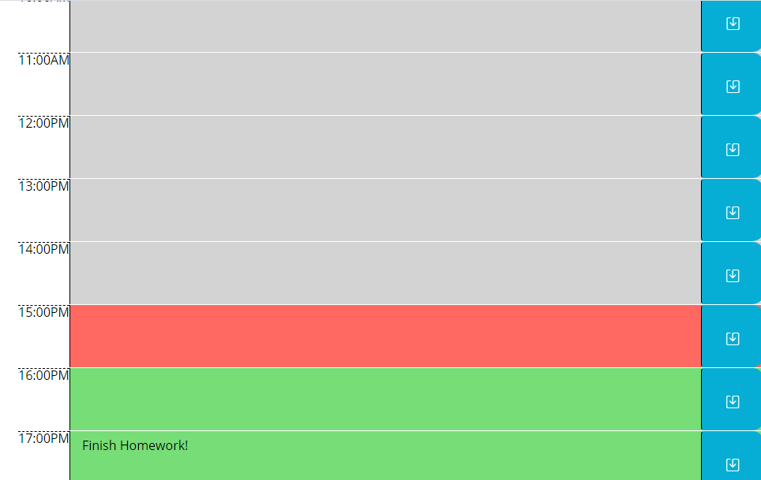
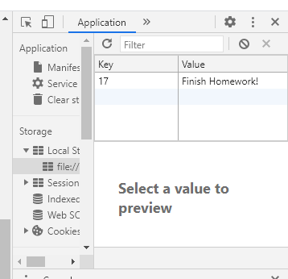

# Week-6-DayPlanner
### Description
In this project, I used JQuery and Moment.Js to create an interactive Workday Day Planner. In the day planner, it will show you what hour you are currently working in. You can add in to dos for the day that will be saved to your personal local storage, to help stay organized. In this project I learned more about JQuery, utilizing <b>this</b> object keyword, as well as utilizing parent and sibling elements within the DOM!

---

### Table of Contents
* [Installation](#Installation) 
* [Usage](#Usage)  
* [Credits](#Credits)  
* [Badges](#Badges)  
* [License](#License)

---

### Installation 
<a href = "https://mbennett1991.github.io/Week-6-DayPlanner/">Click me</a> to use the Day Planner!

---

### Usage  
To further show the interactive-ness of the Day Planner, I have included screenshots of the web page, as well as snidbits of my local storage to show where to dos are saved. 

 

---

### Links
Below is a link to my gitHub pages to see more of my work!

<a href = "https://mbennett1991.github.io/">Click me</a>
 
---
  
### Credits
@ChiggyO

---

### Badges 

---

### License 
© 2020 Trilogy Education Services, a 2U, Inc. brand. All Rights Reserved.